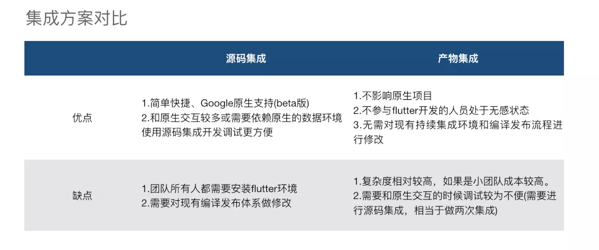
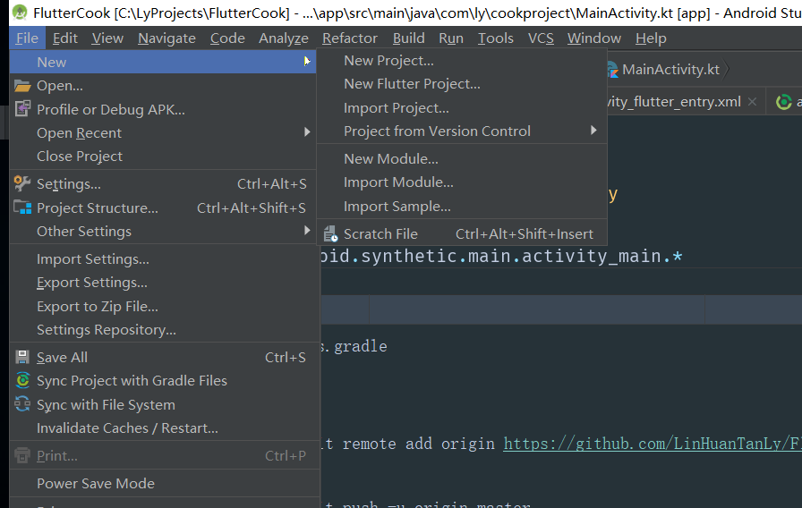
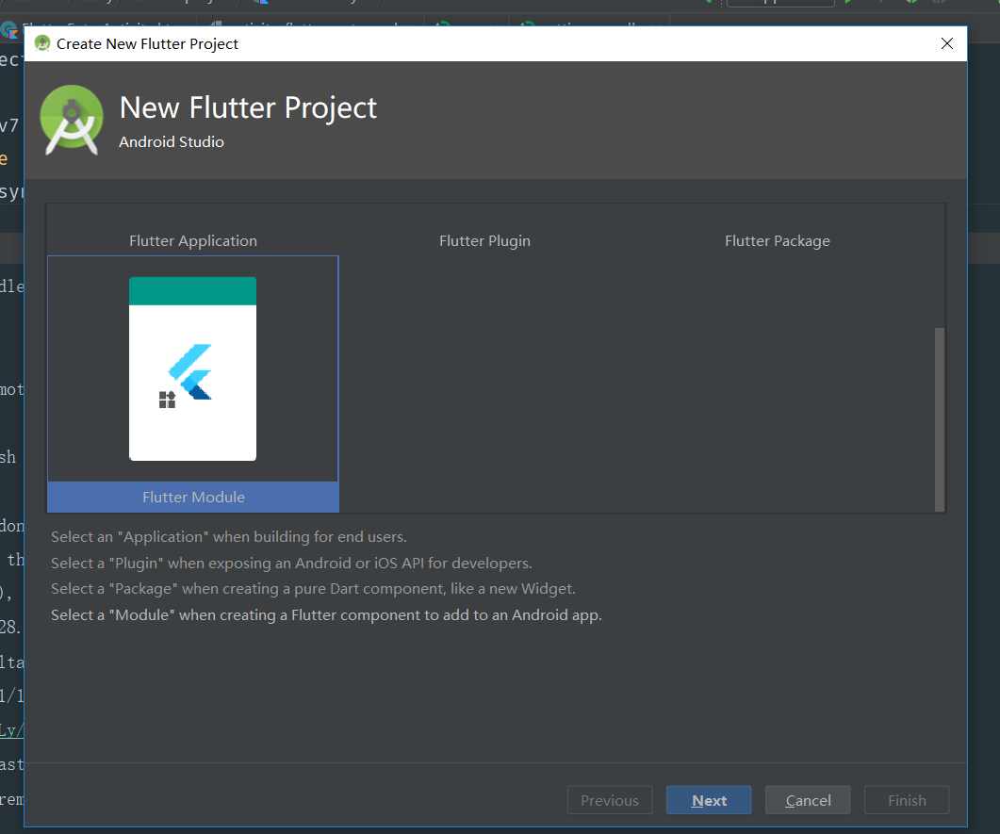
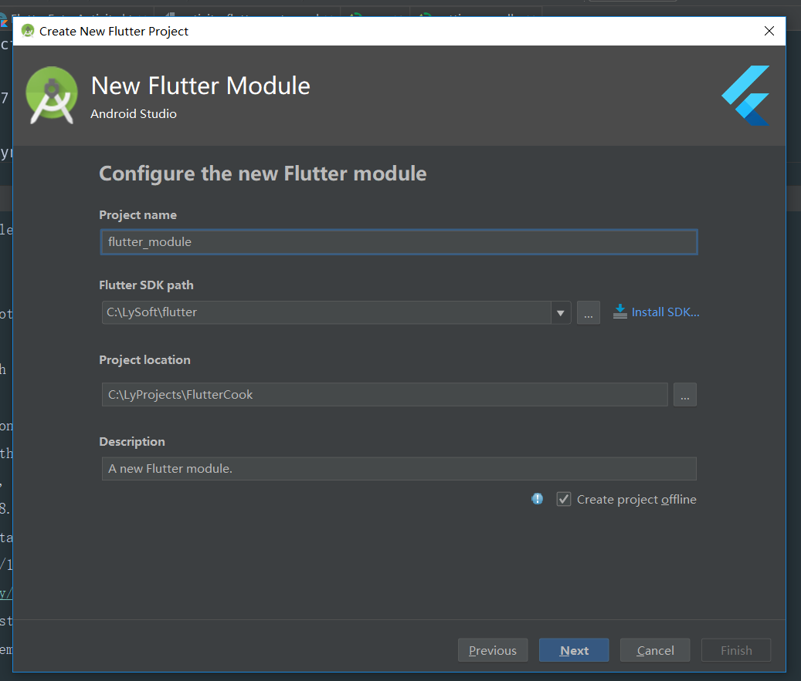
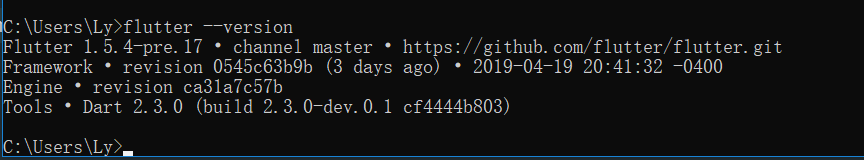
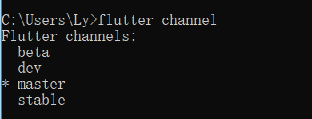
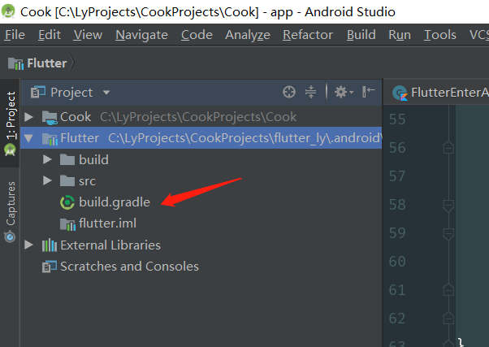

[toc]
# Android项目中嵌入Flutter项目以及各种踩坑（持续更新）

## 分类
  Android原生项目内嵌Flutter项目现在有两种途径：**源码集成**以及**产物集成**
  这里借下图来说明：
  
 
因为我是只有一个人开发，所以我想先试下源码集成，后续有机会也会试下产物集成

## 源码集成

### 新建安卓项目

这一部就不赘述了，安卓狗都知道的

### 新建flutter目录

这里有些分歧，有些人是直接在android目录里面新建了Flutter的module，有些人是把Flutter新建在和Module相齐的目录，其实应该是后者比较规范一点，毕竟还有ios模块要用嘛。

不过我只有安卓，就还是用普通module的方式吧。

#### Android Studio创建

这里有2种创建Flutter模块的方法，选自己喜欢的吧
##### 在androidStudio中新建Flutter Module




稍等as一顿操作，这样就可以新建一个Flutter Module了

##### 在命令行创建Flutter Module
```dart
flutter create -t module {moduleName}
```
比如创建一个叫*ly_module*
```dart
flutter create -t module ly_module
```

##### 在android项目中关联Flutter Module

```gradle
include ':app'
setBinding(new Binding([gradle: this]))
evaluate(new File(
        'xxxxx/.android/include_flutter.groovy'
))
```
##### 在app的build.gradle里面加入对应依赖
```gradle
implementation project(':flutter')
```
##### 新建Flutter模块入口
其实就是新建了一个activity，在里面丢进去flutter模块:
```kotlin
/**
 * Author: Ly
 * Data：2019/4/23-15:49
 * Description:
 */
class FlutterEntryActivity : AppCompatActivity() {
    companion object {
        fun toFlutterEntryActivity(a: Activity) {
            a.startActivity(Intent(a, FlutterEntryActivity::class.java))
        }
    }

    override fun onCreate(savedInstanceState: Bundle?) {
        super.onCreate(savedInstanceState)
        setContentView(R.layout.activity_flutter_entry)
        val flutterView = Flutter.createView(this, lifecycle, "Ly")
        val layout = FrameLayout.LayoutParams(FrameLayout.LayoutParams.MATCH_PARENT, FrameLayout.LayoutParams.MATCH_PARENT)
        addContentView(flutterView, layout)
    }
}
```
这里在debug模式有个问题：
虽然加入了一个view是很快速的问题，但是初始化也是要时间的，所以在debug模式下，会有一定时间的黑屏时间（**测试在release模式下是很ok的，果然flutter的debug模式和release模式是完全不一样的HHHHHH**）
这里找了有三个解决方法，我丢在下面的踩坑上面去。
##### flutter处理
我们上面进入flutter的时候传了3个参数，我们注意下第三个**Ly**,对应的是一个路由地址，
这个我们在flutter中可以拿到
```dart
window.defaultRouteName
```
所以我们在main.dart中可以有如下处理：
```dart
void main() => runApp(_widgetForRoute(window.defaultRouteName));

Widget _widgetForRoute(String route) {
  switch (route) {
    case "Ly":
      return MyApp();
    default:
      return MyApp();
  }
}
```
这里可以根据路由地址跳转到对应的app地址


#### 以上步骤很多博客都可以看到，接下来我们来讲下容易踩坑的地方

##### 分支问题
 现在的时间是2019年4月23日16点53分，版本信息如下：
 
 
切记一定要切到**Master**分支

##### settings.gradle报错
很多时候会发生setting.gradle 我们加的
```gradle
include ':app'
setBinding(new Binding([gradle: this]))
evaluate(new File(
        'xxxxx/.android/include_flutter.groovy'
))
```
报错，我觉得有2个点可以排查
1. 目录路径没有错
2. .anroid/文件存在，如上文所说的命令行创建module，其实不会生成.android & .ios 目录，那这里的依赖就会报错了，这个时候可以在flutter窗口下执行
	**flutter packages get**生成下
##### 项目报错问题 
	依赖完毕后，跑项目，会出现
	```java
	Invoke-customs are only supported starting with Android O
	```
	这个时候需要在app的build.gradle文件中的*android{)*结点加入
	```gradle
	 compileOptions {
        sourceCompatibility JavaVersion.VERSION_1_8
        targetCompatibility JavaVersion.VERSION_1_8
    }
	```
##### debug模式下黑屏
######  显示隐藏方法
1. 一开始的的xml布局文件设置为*Invisible*,注意这里不能设置为*GONE*,因为两者有渲染与否的区别
  ```xml
  <?xml version="1.0" encoding="utf-8"?>
<FrameLayout
    android:id="@+id/flFlutterContainer"
    xmlns:android="http://schemas.android.com/apk/res/android"
    android:layout_width="match_parent"
    android:visibility="invisible"
    android:layout_height="match_parent">
</FrameLayout>
  ```
2. 加载完后再显示出来
```kotlin
        val flutterView = Flutter.createView(this, lifecycle, "Ly")
        flFlutterContainer.addView(flutterView)
        val listeners = arrayOfNulls<FirstFrameListener>(1)
        listeners[0] = FirstFrameListener { flFlutterContainer.visibility = View.VISIBLE }
        flutterView.addFirstFrameListener(listeners[0])
```

###### 重复设置contentView的方法
    ```kotlin
        override fun onCreate(savedInstanceState: Bundle?) {
        super.onCreate(savedInstanceState)
        setContentView(R.layout.activity_flutter_entry)
        val flutterView = Flutter.createView(this, lifecycle, "Ly")
        val layout = FrameLayout.LayoutParams(FrameLayout.LayoutParams.MATCH_PARENT, FrameLayout.LayoutParams.MATCH_PARENT)
        addContentView(flutterView, layout)
    ```
###### 渠道打包的问题（这个坑踩了比较久）
因为我的app是需要打渠道包的，之前也是做了一个很简陋的渠道包方法，也就是在gradle里面设置**productFlavors**，但是这样在嵌入flutter之后就会出问题了
**Check failed: vm. Must be able to initialize the VM.**
翻墙翻了好久~也找了很多资料，终于在**issues**中找到了
[相关资料](https://github.com/flutter/flutter/issues/27028)
这里是因为加了渠道，*flutter_assets*资源拷贝路径出了问题，那既然知道问题了，改吧。
app的build.gradle文件：
```dart
apply plugin: 'com.android.application'

apply plugin: 'kotlin-android'

apply plugin: 'kotlin-android-extensions'

android {
    flavorDimensions ""
    compileSdkVersion 28
    defaultConfig {
        applicationId "com.rongyi.cook"
        minSdkVersion 19
        targetSdkVersion 28
        versionCode 1
        versionName "1.0"
        testInstrumentationRunner "android.support.test.runner.AndroidJUnitRunner"
        compileOptions {
            sourceCompatibility JavaVersion.VERSION_1_8
            targetCompatibility JavaVersion.VERSION_1_8
        }
//        ndk{abiFilters "armeabi-v7a"}
    }
    productFlavors {

        xiaomi {
            manifestPlaceholders = [TYJ_APP_CHANNEL: "xiaomi",]
        }
        c360 {
            manifestPlaceholders = [TYJ_APP_CHANNEL: "c360",]
        }
        baidu {
            manifestPlaceholders = [TYJ_APP_CHANNEL: "baidu",]
        }
        huawei {
            manifestPlaceholders = [TYJ_APP_CHANNEL: "huawei",]
        }
        yingyongbao {
            manifestPlaceholders = [TYJ_APP_CHANNEL: "yingyongbao",]
        }
        vivo {
            manifestPlaceholders = [TYJ_APP_CHANNEL: "vivo",]
        }
    }
    buildTypes {
        release {
            minifyEnabled false
            proguardFiles getDefaultProguardFile('proguard-android.txt'), 'proguard-rules.pro'
        }
        debug {
            manifestPlaceholders = [TYJ_APP_CHANNEL: "\\ 19921208015",]
            minifyEnabled false
        }
    }
    lintOptions {
        disable 'CheckResult'
    }
    // 自定义输出配置
    android.applicationVariants.all { variant ->
        variant.outputs.all {
            outputFileName = "${variant.name}_${variant.versionName}_${variant.name}.apk"
        }
    }
}

dependencies {
    implementation fileTree(include: ['*.jar'], dir: 'libs')
    implementation "org.jetbrains.kotlin:kotlin-stdlib-jdk7:$kotlin_version"
    implementation 'com.android.support:appcompat-v7:28.0.0'
    implementation 'com.android.support.constraint:constraint-layout:1.1.3'
    testImplementation 'junit:junit:4.12'
    androidTestImplementation 'com.android.support.test:runner:1.0.2'
    androidTestImplementation 'com.android.support.test.espresso:espresso-core:3.0.2'
    implementation project(':easyly')
    implementation project(':flutter')
}

```

这里加入了6个渠道，而对应的，我们也要修改下flutter的build.gradle文件

之前的build.gradle：
```gradle
// Generated file. Do not edit.

def localProperties = new Properties()
def localPropertiesFile = new File(buildscript.sourceFile.parentFile.parentFile, 'local.properties')
if (localPropertiesFile.exists()) {
    localPropertiesFile.withReader('UTF-8') { reader ->
        localProperties.load(reader)
    }
}

def flutterRoot = localProperties.getProperty('flutter.sdk')
if (flutterRoot == null) {
    throw new GradleException("Flutter SDK not found. Define location with flutter.sdk in the local.properties file.")
}

def flutterVersionCode = localProperties.getProperty('flutter.versionCode')
if (flutterVersionCode == null) {
    flutterVersionCode = '1'
}

def flutterVersionName = localProperties.getProperty('flutter.versionName')
if (flutterVersionName == null) {
    flutterVersionName = '1.0'
}

apply plugin: 'com.android.library'
apply from: "$flutterRoot/packages/flutter_tools/gradle/flutter.gradle"

android {
    compileSdkVersion 28

    defaultConfig {
        minSdkVersion 16
        targetSdkVersion 28
        versionCode flutterVersionCode.toInteger()
        versionName flutterVersionName
        testInstrumentationRunner "android.support.test.runner.AndroidJUnitRunner"
    }
}

flutter {
    source '../..'
}

dependencies {
    testImplementation 'junit:junit:4.12'
    implementation 'com.android.support:support-v13:27.1.1'
    implementation 'com.android.support:support-annotations:27.1.1'
}

```

修改后的build.gradle
```gradle
// Generated file. Do not edit.

def localProperties = new Properties()
def localPropertiesFile = new File(buildscript.sourceFile.parentFile.parentFile, 'local.properties')
if (localPropertiesFile.exists()) {
    localPropertiesFile.withReader('UTF-8') { reader ->
        localProperties.load(reader)
    }
}

def flutterRoot = localProperties.getProperty('flutter.sdk')
if (flutterRoot == null) {
    throw new GradleException("Flutter SDK not found. Define location with flutter.sdk in the local.properties file.")
}

def flutterVersionCode = localProperties.getProperty('flutter.versionCode')
if (flutterVersionCode == null) {
    flutterVersionCode = '1'
}

def flutterVersionName = localProperties.getProperty('flutter.versionName')
if (flutterVersionName == null) {
    flutterVersionName = '1.0'
}

apply plugin: 'com.android.library'
apply from: "$flutterRoot/packages/flutter_tools/gradle/flutter.gradle"

android {
    compileSdkVersion 28
    flavorDimensions ""
    defaultConfig {
        minSdkVersion 16
        targetSdkVersion 28
        versionCode flutterVersionCode.toInteger()
        versionName flutterVersionName
        testInstrumentationRunner "android.support.test.runner.AndroidJUnitRunner"
    }
    productFlavors {

        xiaomi {
            manifestPlaceholders = [TYJ_APP_CHANNEL: "xiaomi",]
        }
        c360 {
            manifestPlaceholders = [TYJ_APP_CHANNEL: "c360",]
        }
        baidu {
            manifestPlaceholders = [TYJ_APP_CHANNEL: "baidu",]
        }
        huawei {
            manifestPlaceholders = [TYJ_APP_CHANNEL: "huawei",]
        }
        yingyongbao {
            manifestPlaceholders = [TYJ_APP_CHANNEL: "yingyongbao",]
        }
        vivo {
            manifestPlaceholders = [TYJ_APP_CHANNEL: "vivo",]
        }
    }
}

flutter {
    source '../..'
}

dependencies {
    testImplementation 'junit:junit:4.12'
    implementation 'com.android.support:support-v13:27.1.1'
    implementation 'com.android.support:support-annotations:27.1.1'
}

```


