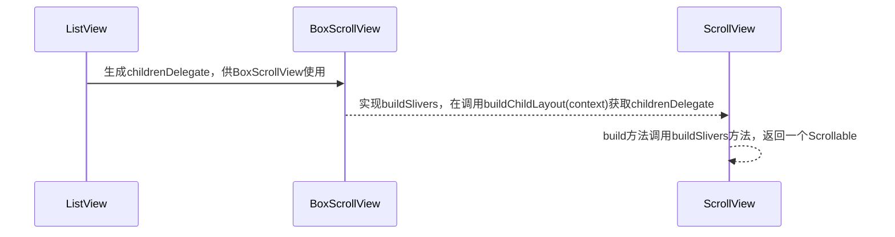

[toc]


先从这一块朴素的代码开启我们的旅程：

```dart
ListView.builder(
        itemBuilder: ((context, index) {
          return ListTile(
            title: Text("this is $index"),
          );
        }),
        itemCount: 20,
      )
```


我很好奇：

1. ListView是怎么渲染的？
2. ListView怎么做到控制性能？
3. Sliver系列和普通滚动组件有啥区别？


## ListView是怎么渲染的？


核心代码是这块，主要是定义了一个**childrenDelegate**

```
  childrenDelegate = SliverChildBuilderDelegate(
         itemBuilder,
         findChildIndexCallback: findChildIndexCallback,
         childCount: itemCount,
         addAutomaticKeepAlives: addAutomaticKeepAlives,
         addRepaintBoundaries: addRepaintBoundaries,
         addSemanticIndexes: addSemanticIndexes,
       )
```

它在哪里用到的，往上找，原来用在了ListView 的这里：

```da
  @override
  Widget buildChildLayout(BuildContext context) {
    if (itemExtent != null) {
      return SliverFixedExtentList(
        delegate: childrenDelegate,
        itemExtent: itemExtent!,
      );
    } else if (prototypeItem != null) {
      return SliverPrototypeExtentList(
        delegate: childrenDelegate,
        prototypeItem: prototypeItem!,
      );
    }
    return SliverList(delegate: childrenDelegate);
  }
```

那**buildChildLayout**在哪里调用？继续顺藤摸瓜，找到了抽象类**BoxScrollView**，其中override了一个**buildSlivers**

```dart
    @override
  List<Widget> buildSlivers(BuildContext context) {
    Widget sliver = buildChildLayout(context);
    EdgeInsetsGeometry? effectivePadding = padding;
    if (padding == null) {
      ///包裹一个MediaQuery
      ///根据这个可以获取到设备的信息
      final MediaQueryData? mediaQuery = MediaQuery.maybeOf(context);
      if (mediaQuery != null) {
        // Automatically pad sliver with padding from MediaQuery.
        final EdgeInsets mediaQueryHorizontalPadding =
            mediaQuery.padding.copyWith(top: 0.0, bottom: 0.0);
        final EdgeInsets mediaQueryVerticalPadding =
            mediaQuery.padding.copyWith(left: 0.0, right: 0.0);
        // Consume the main axis padding with SliverPadding.
        effectivePadding = scrollDirection == Axis.vertical
            ? mediaQueryVerticalPadding
            : mediaQueryHorizontalPadding;
        // Leave behind the cross axis padding.
        sliver = MediaQuery(
          data: mediaQuery.copyWith(
            padding: scrollDirection == Axis.vertical
                ? mediaQueryHorizontalPadding
                : mediaQueryVerticalPadding,
          ),
          child: sliver,
        );
      }
    }
		///如果有 padding 那就再包裹一个SliverPadding
    if (effectivePadding != null) {
      sliver = SliverPadding(padding: effectivePadding, sliver: sliver);
    }
    return <Widget>[ sliver ];
  }
```

继续网上翻，终于找到正主了，位于抽象类**ScrollView**里的 build 方法

```dart
 @override
  Widget build(BuildContext context) {
    ///拿到实现类返回的具体 Widget 列表
    final List<Widget> slivers = buildSlivers(context);
    
    final AxisDirection axisDirection = getDirection(context);
		///[PrimaryScrollController.shouldInherit(context, scrollDirection)]
    ///检查当前的[PrimaryScrollController]是否自动继承[Axis]------区分各个平台
    ///
    ///
    /// ************************************
    ///如果没有设置[primary]
    ///那就找它parents，看是否继承
    final bool effectivePrimary = primary
        ?? controller == null && PrimaryScrollController.shouldInherit(context, scrollDirection);
		/// 如果[effectivePrimary]
    /// true: 使用上下文的滑动控制器
    /// false： 使用自定义的滑动控制器
    final ScrollController? scrollController = effectivePrimary
        ? PrimaryScrollController.maybeOf(context)
        : controller;
    ///根据传入的参数生成对应的[Scrollable]
    final Scrollable scrollable = Scrollable(
      dragStartBehavior: dragStartBehavior,
      axisDirection: axisDirection,
      controller: scrollController,
      physics: physics,
      scrollBehavior: scrollBehavior,
      semanticChildCount: semanticChildCount,
      restorationId: restorationId,
      viewportBuilder: (BuildContext context, ViewportOffset offset) {
        return buildViewport(context, offset, axisDirection, slivers);
      },
      clipBehavior: clipBehavior,
    );
    ///根据[effectivePrimary]以及是否自定义了[ScrollController]生成不同的Scrollable
    ///如果我定义了[ScrollController] 但是我又希望[effectivePrimary]不受主控制器控制
    ///那么就使用[PrimaryScrollController.none(child: scrollable)]包裹它
    ///
    /// 反之
    ///
    /// 就正常使用
    final Widget scrollableResult = effectivePrimary && scrollController != null
        // Further descendant ScrollViews will not inherit the same PrimaryScrollController
        ? PrimaryScrollController.none(child: scrollable)
        : scrollable;
    ///如果我要求我的键盘在滑动的时候被关闭掉
    ///那么就添加一个监听
    ///
    /// 反之
    ///
    /// 直接返回
    if (keyboardDismissBehavior == ScrollViewKeyboardDismissBehavior.onDrag) {
      return NotificationListener<ScrollUpdateNotification>(
        child: scrollableResult,
        onNotification: (ScrollUpdateNotification notification) {
          final FocusScopeNode focusScope = FocusScope.of(context);
          if (notification.dragDetails != null && focusScope.hasFocus) {
            focusScope.unfocus();
          }
          return false;
        },
      );
    } else {
      return scrollableResult;
    }
  }
```

这里又出现了一个新面孔**Scrollable**，它一个用于监听用户手势，从而响应滚动的 widget，从它的 build 方法可以看出来：

```dart
 @override
  Widget build(BuildContext context) {
    assert(_position != null);
		///[_ScrollableScope]继承了[InheritedWidget]
    ///可共享传递[position]属性
    Widget result = _ScrollableScope(
      scrollable: this,
      position: position,
      child: Listener(
        ///监听 point 的信号变化
        onPointerSignal: _receivedPointerSignal,
        child: RawGestureDetector(
          key: _gestureDetectorKey,
          gestures: _gestureRecognizers,
          behavior: HitTestBehavior.opaque,
          excludeFromSemantics: widget.excludeFromSemantics,
          child: Semantics(
            explicitChildNodes: !widget.excludeFromSemantics,
            /// 一个可以忽略用户行为的组件，但是是否忽略
            ///由[_shouldIgnorePointer]决定
            child: IgnorePointer(
              key: _ignorePointerKey,
              ignoring: _shouldIgnorePointer,
              ignoringSemantics: false,
              ///拿到 position
              ///传入[viewportBuilder]使用
              child: widget.viewportBuilder(context, position),
            ),
          ),
        ),
      ),
    );
		///是否排除语义
    if (!widget.excludeFromSemantics) {
      ///不排除 那包裹在一个监听器里面[NotificationListener],
      ///通过[_handleScrollMetricsNotification]回调出去
      result = NotificationListener<ScrollMetricsNotification>(
        onNotification: _handleScrollMetricsNotification,
        child: _ScrollSemantics(
          key: _scrollSemanticsKey,
          position: position,
          allowImplicitScrolling: _physics!.allowImplicitScrolling,
          semanticChildCount: widget.semanticChildCount,
          child: result,
        )
      );
    }
		///包裹在[ScrollableDetails]组件里
    ///包含了滚动方向、控制器、剪切模式
    final ScrollableDetails details = ScrollableDetails(
      direction: widget.axisDirection,
      controller: _effectiveScrollController,
      clipBehavior: widget.clipBehavior,
    );
		///创建了一个滚动条
    ///支持用户进行滚动行为
    result = _configuration.buildScrollbar(
      context,
      _configuration.buildOverscrollIndicator(context, result, details),
      details,
    );

		///提供一个选择注册器
    final SelectionRegistrar? registrar = SelectionContainer.maybeOf(context);
    if (registrar != null) {
      result = _ScrollableSelectionHandler(
        state: this,
        position: position,
        registrar: registrar,
        child: result,
      );
    }
		///返回了包含了各种功能性的[widget.viewportBuilder(context, position)]
    return result;
  }
```


到了这一步，好像有点清晰了 又有点模糊了，重新捋捋




总的流程就是：

1. 无论是ListView.builder还是 ListView.custom 最终都是生成一个childrenDelegate对象
2. 而这个childrenDelegate会被override的buildChildLayout方法使用
3. buildChildLayout方法会被父类BoxScrollView的buildSlivers方法调用
4. buildSlivers会被爷爷ScrollView 的 build 方法调用，继而获取到响应的 ListView 里实现返回的Widget 列表
5. 而 build 方法会对这个 Widget 列表进行Scrollable包裹，通过一个继承自InheritedWidget的_ScrollableScope，通过同享 position 的方法让 Widget 根据用户手势进行绘制从而使他具备滚动能力


## ListView怎么做到控制性能？


这个问题回到ScrollView的 build 方法：

```dart
 @override
  Widget build(BuildContext context) {
   	///***省略无关代码
    final Scrollable scrollable = Scrollable(
      dragStartBehavior: dragStartBehavior,
      axisDirection: axisDirection,
      controller: scrollController,
      physics: physics,
      scrollBehavior: scrollBehavior,
      semanticChildCount: semanticChildCount,
      restorationId: restorationId,
      viewportBuilder: (BuildContext context, ViewportOffset offset) {
        return buildViewport(context, offset, axisDirection, slivers);
      },
      clipBehavior: clipBehavior,
    );
  }
```

看到实际的 viewport 是通过viewportBuilder方法获取的

```dart
 @protected
  Widget buildViewport(
    BuildContext context,
    ViewportOffset offset,
    AxisDirection axisDirection,
    List<Widget> slivers,
  ) {
  ///这里根据shrinkWrap返回了两种Viewport
    if (shrinkWrap) {
      return ShrinkWrappingViewport(
        axisDirection: axisDirection,
        offset: offset,
        slivers: slivers,
        clipBehavior: clipBehavior,
      );
    }
    return Viewport(
      axisDirection: axisDirection,
      offset: offset,
      slivers: slivers,
      cacheExtent: cacheExtent,
      center: center,
      anchor: anchor,
      clipBehavior: clipBehavior,
    );
  }

```

而 viewport 继承自**MultiChildRenderObjectWidget**，它可以自绘多个 child 组件

```dart
class Viewport extends MultiChildRenderObjectWidget {
  ///省略无关代码
    Viewport({
    super.key,
    ///主轴方向
    this.axisDirection = AxisDirection.down,
    ///横轴方向
    this.crossAxisDirection,
    ///用于指定滚动视图中的零滚动偏移的相对位置
  	///取值在[0.0-1.0]之间
  	///如果是 0.0 那么是在初始位置
  	///如果是 1.0 那么就是在结束位置
    this.anchor = 0.0,
    ///偏移量
    required this.offset,
    ///用于在自定义滚动视图（CustomScrollView）中指定一个子元素作为生长方向的"中心"点
    this.center,
    ///用于控制视图的缓存区域大小
 		///可用于在滚动方向上更多地缓存 item （用户不可见部分，即提前渲染缓存）
  	///但是如果设置过大容易造成新能损耗
    this.cacheExtent,
    ///用于控制视口[Viewport] 的缓存区域[cacheExtent]的模式
  	///[CacheExtentStyle.pixel] 以像素模式
  	///[CacheExtentStyle.viewport】跟当前视图一样
    this.cacheExtentStyle = CacheExtentStyle.pixel,
    ///针对超出视图部分的裁切行为
    this.clipBehavior = Clip.hardEdge,
    ///儿子们
    List<Widget> slivers = const <Widget>[],
  }) : 
    ///省略无关代码
    super(children: slivers);
}
```


当然，看一个组件，我们要重点看的是**RenderObject**和**Element**

### _ViewportElement

element 里面除了常规对RenderObject的操作外，主要针对的是Center的更新操作

它的定义是：

```dart
  ///用于在自定义滚动视图（CustomScrollView）中指定一个子元素作为生长方向的"中心"点
  final Key? center;
```

```dart
///更新 center 的 key 对应的数据
  void _updateCenter() {
    final Viewport viewport = widget as Viewport;
    if (viewport.center != null) {
      ///如果之前已经制定了 center 了
      int elementIndex = 0;

      ///遍历拿到 childrens 里面对应的 element
      ///把它对应的 renderobject 赋值给对应的 center key element
      ///并且记录它的下标为_centerSlotIndex
      for (final Element e in children) {
        if (e.widget.key == viewport.center) {
          renderObject.center = e.renderObject as RenderSliver?;
          break;
        }
        elementIndex++;
      }
      assert(elementIndex < children.length);
      _centerSlotIndex = elementIndex;
    } else if (children.isNotEmpty) {
      ///如果没有 centerkey 拿 children 的第一个 item 便是默认
      ///把它的 renderObject 赋值给当前的 renderObject.center
      ///并且记录它的下标为_centerSlotIndex为 0
      renderObject.center = children.first.renderObject as RenderSliver?;
      _centerSlotIndex = 0;
    } else {
      ///如果当前的 viewport 没有子元素
      ///那么清空 renderObject.center 以及 _centerSlotIndex
      renderObject.center = null;
      _centerSlotIndex = null;
    }
  }

  ///在father 类[MultiChildRenderObjectElement]里面已经做了 insert 操作了
  ///[renderObject.insert(child, after: slot.value?.renderObject);]
  ///这里为什么要重新 for 循环遍历一遍
  ///是因为[slot]可能带有 center 属性
  ///而当列表数据更新的时候，[insertRenderObjectChild]必然会被调用
  ///这个时候需要重新赋值[renderObject.center]以便布局渲染为居中
  @override
  void insertRenderObjectChild(RenderObject child, IndexedSlot<Element?> slot) {
    super.insertRenderObjectChild(child, slot);
    // Once [mount]/[update] are done, the `renderObject.center` will be updated
    // in [_updateCenter].
    if (!_doingMountOrUpdate && slot.index == _centerSlotIndex) {
      renderObject.center = child as RenderSliver?;
    }
  }

```


### RenderViewport

重点还是在 renderObject 里面，我们知道是通过改变offset 进而改变窗口位置实现的滚动效果的，但是他是怎么计算出来的呢？

从上面我们可以知道会根据用户的手势动作，回调出 **offset**来进行滚动绘制，那我们就直接找它：

```dart
  @override
  void performLayout() {
		///根据滑动的方向
    ///修改 offset 的 dimension
    switch (axis) {
      case Axis.vertical:
        offset.applyViewportDimension(size.height);
        break;
      case Axis.horizontal:
        offset.applyViewportDimension(size.width);
        break;
    }
		///如果没有 center
    if (center == null) {
      ///也没有 child
      ///那就直接都为 0
      assert(firstChild == null);
      _minScrollExtent = 0.0;
      _maxScrollExtent = 0.0;
      _hasVisualOverflow = false;
      offset.applyContentDimensions(0.0, 0.0);
      return;
    }
    assert(center!.parent == this);
    
    final double mainAxisExtent;
    final double crossAxisExtent;
    switch (axis) {
      case Axis.vertical:
        mainAxisExtent = size.height;
        crossAxisExtent = size.width;
        break;
      case Axis.horizontal:
        mainAxisExtent = size.width;
        crossAxisExtent = size.height;
        break;
    }
		///调整 center 的 offset
    final double centerOffsetAdjustment = center!.centerOffsetAdjustment;

    double correction;
    ///进行最多次数为_maxLayoutCycles的校正
    int count = 0;
    do {
      assert(offset.pixels != null);
      ///拿到校正的值
      correction = _attemptLayout(mainAxisExtent, crossAxisExtent, offset.pixels + centerOffsetAdjustment);
      ///如果校正值不等于 0
      if (correction != 0.0) {
        ///直接校正
        offset.correctBy(correction);
      } else {
        ///如果不需要校正
        ///更新它的最大滚动&最小滚动距离
        if (offset.applyContentDimensions(
              math.min(0.0, _minScrollExtent + mainAxisExtent * anchor),
              math.max(0.0, _maxScrollExtent - mainAxisExtent * (1.0 - anchor)),
           )) {
          break;
        }
      }
      count += 1;
    } while (count < _maxLayoutCycles);
    assert(() {
      if (count >= _maxLayoutCycles) {
        assert(count != 1);
       	///省略无关代码
      return true;
    }());
  }
```


我比较好奇的是**_attemptLayout**，怎么计算矫正的？


```dart
 double _attemptLayout(double mainAxisExtent, double crossAxisExtent, double correctedOffset) {
		///省略断言
   	
    ///最小滚动范围
    _minScrollExtent = 0.0;
   	///最大滚动范围
    _maxScrollExtent = 0.0;
   	///是否有视觉溢出
    _hasVisualOverflow = false;

		///针对 center 的 offset
    final double centerOffset = mainAxisExtent * anchor - correctedOffset;
   	///反向的剩余绘制范围
    final double reverseDirectionRemainingPaintExtent = clampDouble(centerOffset, 0.0, mainAxisExtent);
    ///正向的剩余绘制范围
    final double forwardDirectionRemainingPaintExtent = clampDouble(mainAxisExtent - centerOffset, 0.0, mainAxisExtent);
		///缓存的尺寸模式
   	///有像素和直接+1 两种模式
    switch (cacheExtentStyle) {
      case CacheExtentStyle.pixel:
        _calculatedCacheExtent = cacheExtent;
        break;
      case CacheExtentStyle.viewport:
        _calculatedCacheExtent = mainAxisExtent * _cacheExtent;
        break;
    }
		///总大小=主轴方向的+前面缓存方向+后面缓存方向
    final double fullCacheExtent = mainAxisExtent + 2 * _calculatedCacheExtent!;
   	///center offset=center 本身的 offset+前面的缓存的
    final double centerCacheOffset = centerOffset + _calculatedCacheExtent!;
    ///反向 脑壳疼
    final double reverseDirectionRemainingCacheExtent = clampDouble(centerCacheOffset, 0.0, fullCacheExtent);
   	///正向 脑壳疼
    final double forwardDirectionRemainingCacheExtent = clampDouble(fullCacheExtent - centerCacheOffset, 0.0, fullCacheExtent);
		///center 前面的 widget
    final RenderSliver? leadingNegativeChild = childBefore(center!);
	
    if (leadingNegativeChild != null) {
      ///如果前面还有
      ///那还需要再计算
      final double result = layoutChildSequence(
        child: leadingNegativeChild,
        scrollOffset: math.max(mainAxisExtent, centerOffset) - mainAxisExtent,
        overlap: 0.0,
        layoutOffset: forwardDirectionRemainingPaintExtent,
        remainingPaintExtent: reverseDirectionRemainingPaintExtent,
        mainAxisExtent: mainAxisExtent,
        crossAxisExtent: crossAxisExtent,
        growthDirection: GrowthDirection.reverse,
        advance: childBefore,
        remainingCacheExtent: reverseDirectionRemainingCacheExtent,
        cacheOrigin: clampDouble(mainAxisExtent - centerOffset, -_calculatedCacheExtent!, 0.0),
      );
      if (result != 0.0) {
        return -result;
      }
    }
		///如果前面没有了 那就是按 center 来
    return layoutChildSequence(
      child: center,
      scrollOffset: math.max(0.0, -centerOffset),
      overlap: leadingNegativeChild == null ? math.min(0.0, -centerOffset) : 0.0,
      layoutOffset: centerOffset >= mainAxisExtent ? centerOffset: reverseDirectionRemainingPaintExtent,
      remainingPaintExtent: forwardDirectionRemainingPaintExtent,
      mainAxisExtent: mainAxisExtent,
      crossAxisExtent: crossAxisExtent,
      growthDirection: GrowthDirection.forward,
      advance: childAfter,
      remainingCacheExtent: forwardDirectionRemainingCacheExtent,
      cacheOrigin: clampDouble(centerOffset, -_calculatedCacheExtent!, 0.0),
    );
  }
```

而layoutChildSequence是针对子布局的 layout 布局

```dart
 double layoutChildSequence({
    required RenderSliver? child,
    required double scrollOffset,
    required double overlap,
    required double layoutOffset,
    required double remainingPaintExtent,
    required double mainAxisExtent,
    required double crossAxisExtent,
    required GrowthDirection growthDirection,
    required RenderSliver? Function(RenderSliver child) advance,
    required double remainingCacheExtent,
    required double cacheOrigin,
  }) {
    assert(scrollOffset.isFinite);
    assert(scrollOffset >= 0.0);
   	///初始化 offset
    final double initialLayoutOffset = layoutOffset;
   	///拿到滑动方向
    final ScrollDirection adjustedUserScrollDirection =
        applyGrowthDirectionToScrollDirection(offset.userScrollDirection, growthDirection);
    assert(adjustedUserScrollDirection != null);
   	///最大的绘制 offset
    double maxPaintOffset = layoutOffset + overlap;
   	///初始化前面的滚动距离
    double precedingScrollExtent = 0.0;

    while (child != null) {
      ///子节点的滚动偏移量
      final double sliverScrollOffset = scrollOffset <= 0.0 ? 0.0 : scrollOffset;
      ///修正值
      final double correctedCacheOrigin = math.max(cacheOrigin, -sliverScrollOffset);
      ///修正缓存范围
      final double cacheExtentCorrection = cacheOrigin - correctedCacheOrigin;
			
      assert(sliverScrollOffset >= correctedCacheOrigin.abs());
      assert(correctedCacheOrigin <= 0.0);
      assert(sliverScrollOffset >= 0.0);
      assert(cacheExtentCorrection <= 0.0);
			///进行布局计算
      ///包括滚动方向等
      child.layout(SliverConstraints(
        axisDirection: axisDirection,
        growthDirection: growthDirection,
        userScrollDirection: adjustedUserScrollDirection,
        scrollOffset: sliverScrollOffset,
        precedingScrollExtent: precedingScrollExtent,
        overlap: maxPaintOffset - layoutOffset,
        remainingPaintExtent: math.max(0.0, remainingPaintExtent - layoutOffset + initialLayoutOffset),
        crossAxisExtent: crossAxisExtent,
        crossAxisDirection: crossAxisDirection,
        viewportMainAxisExtent: mainAxisExtent,
        remainingCacheExtent: math.max(0.0, remainingCacheExtent + cacheExtentCorrection),
        cacheOrigin: correctedCacheOrigin,
      ), parentUsesSize: true);
			///获取子节点的布局信息
      final SliverGeometry childLayoutGeometry = child.geometry!;
      assert(childLayoutGeometry.debugAssertIsValid());
			
			///如果更正信息存在 那直接返回
      if (childLayoutGeometry.scrollOffsetCorrection != null) {
        return childLayoutGeometry.scrollOffsetCorrection!;
      }
      
      final double effectiveLayoutOffset = layoutOffset + childLayoutGeometry.paintOrigin; 
      if (childLayoutGeometry.visible || scrollOffset > 0) {
        updateChildLayoutOffset(child, effectiveLayoutOffset, growthDirection);
      } else {
        updateChildLayoutOffset(child, -scrollOffset + initialLayoutOffset, growthDirection);
      }
			///更新 maxPaintOffset，确保它考虑到当前子节点的绘制偏移量，以便确定下一个子节点的布局位置。
      maxPaintOffset = math.max(effectiveLayoutOffset + childLayoutGeometry.paintExtent, maxPaintOffset);
      ///更新 scrollOffset，precedingScrollExtent 和 layoutOffset，以便迭代下一个子节点。
      scrollOffset -= childLayoutGeometry.scrollExtent;
      precedingScrollExtent += childLayoutGeometry.scrollExtent;
      layoutOffset += childLayoutGeometry.layoutExtent;
      ///如果childLayoutGeometry的缓存距离不为 0
      if (childLayoutGeometry.cacheExtent != 0.0) {
        ///更新remainingCacheExtent和cacheOrigin
        remainingCacheExtent -= childLayoutGeometry.cacheExtent - cacheExtentCorrection;
        cacheOrigin = math.min(correctedCacheOrigin + childLayoutGeometry.cacheExtent, 0.0);
      }
			///更新滑动方向相关的子节点信息
      updateOutOfBandData(growthDirection, childLayoutGeometry);
			///拿下一个节点 继续
      child = advance(child);
    }
    return 0.0;
  }
```

其实就是一个不断回调不断刷新 offset 、而 viewport 会根据 offset 以及你设置的配置不断计算、不断绘制造成滚动效果的过程